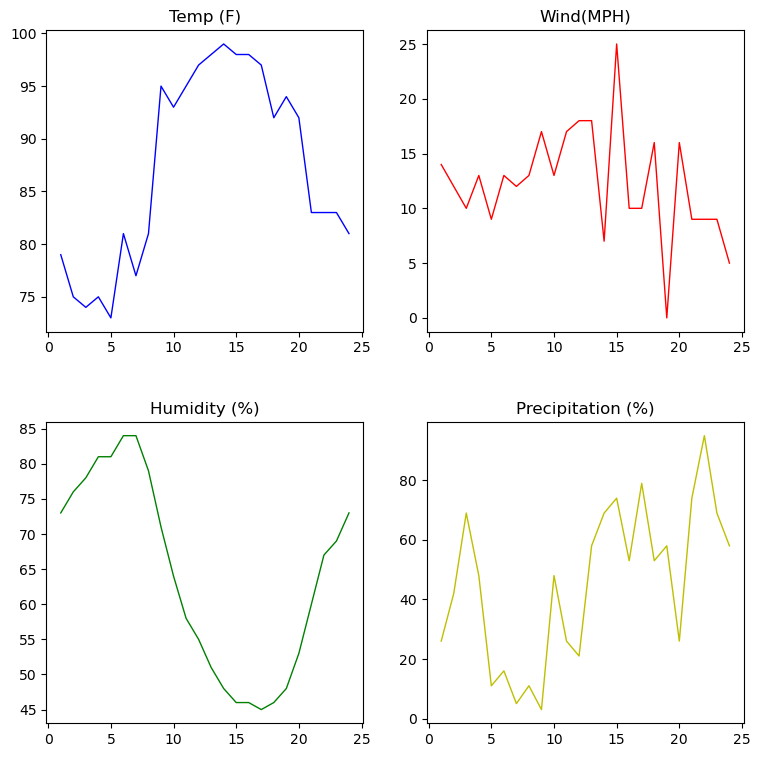

# Subplots

Suplot is used to display multiple plots in the same window. You can arrange plots in a regular grid.

* the syntax for subplot in subplot(m,n,p) = Mevcut pencereyi m x n boyutunda bir ızgaraya böler ve p ile belirtilen konumda bir alt grafik için bir eksen oluşturur.

## Layout and Spacing Adjustments

* Alt planlar oluşturulurken dikkat edilmesi gereken iki önemli faktör düzen ve aralık ayarlamalarıdır.

* plt.subplots_adjust() 

Alt grafikler arasındaki mesafeleri ayarlamak ve bunları ızgara üzerinde hareket ettirmek için hspace ve wspace parametreleriyle bu methodu kullan.

wspace = Top

hspace = Bottom

### Demo1 - Subplot : create multiple subplots and display them using various methods


```python
#import required libraries 
import matplotlib.pyplot as plt
from matplotlib import style
%matplotlib inline
```


```python
#define temp, wind, humidity, precipitation data and Time hrs data

temp_data = [79,75,74,75,73,81,77,81,95,93,95,97,98,99,98,98,97,92,94,92,83,83,83,81]
wind_data = [14,12,10,13,9,13,12,13,17,13,17,18,18,7,25,10,10,16,0,16,9,9,9,5]
time_hrs = [1,2,3,4,5,6,7,8,9,10,11,12,13,14,15,16,17,18,19,20,21,22,23,24]
humidity_data = [73,76,78,81,81,84,84,79,71,64,58,55,51,48,46,46,45,46,48,53,60,67,69,73]
precipitation_data = [26,42,69,48,11,16,5,11,3,48,26,21,58,69,74,53,79,53,58,26,74,95,69,58]

```


```python
#draw suplots for (1,2,1) and (1,2,2)

plt.figure(figsize =(8,4))
plt.subplots_adjust(hspace =.25)
plt.subplot(1,2,1)
plt.title('Temp')
plt.plot(time_hrs,temp_data,color ='b',linestyle ='-',linewidth=1)
plt.subplot(1,2,2)
plt.title('Wind')
plt.plot(time_hrs,wind_data,color ='r',linestyle = '-',linewidth=1)


```


    [<matplotlib.lines.Line2D at 0x7fa683edcaf0>]


    

    


```python
#draw subplots for (2,1,1) and (2,1,2)
plt.figure(figsize= (6,6))
plt.subplots_adjust(hspace=.25)
plt.subplot(2,1,1)
plt.title('Humidity')
plt.plot(time_hrs, humidity_data, color='b',linestyle='-', linewidth=1)

plt.subplot(2,1,2)
plt.title('Precipitation')
plt.plot(time_hrs, precipitation_data, color='r', linestyle='-', linewidth=1)
plt.show()


```


    

    


```python
#draw subplots for (2,2,1), (2,2,2), (2,2,3) and (2,2,4)

plt.figure(figsize=(9,9))
plt.subplots_adjust(hspace=.3)
plt.subplot(2,2,1)
plt.title('Temp (F)')
plt.plot(time_hrs, temp_data,color='b', linestyle='-',linewidth=1)
plt.subplot(2,2,2)
plt.title('Wind(MPH)')
plt.plot(time_hrs,wind_data,color='r', linestyle='-', linewidth=1)
plt.subplot(2,2,3)
plt.title('Humidity (%)')
plt.plot(time_hrs,humidity_data,color='g',linestyle='-',linewidth=1)
plt.subplot(2,2,4)
plt.title('Precipitation (%)')
plt.plot(time_hrs,precipitation_data,color='y',linestyle='-',linewidth=1)
plt.show()


```


    

    


```python

```


```python

```
